## Scaffolding models for queries

First, create the initial database:

1. `cd src/Infrastructure/ViaEventAssociation.Infrastructure.EfcDmPersistence`
2. `dotnet ef migrations add InitialCreate`
3. `dotnet ef database update`

Next, scaffold the models:

1. `cd src/Infrastructure/ViaEventAssociation.Infrastructure.EfcQueries`
2. `dotnet ef dbcontext scaffold "Data Source=../ViaEventAssociation.Infrastructure.EfcDmPersistence/database.sqlite" Microsoft.EntityFrameworkCore.Sqlite --output-dir Models --context QueryContext --context-dir . --force --no-onconfiguring`

By default, the `dotnet ef dbcontext scaffold` command generates an `OnConfiguring` method in the `QueryContext` class that includes the connection string. That did not work well with our testing setup, where we want to use a different connection string for the tests. Therefore, `--no-onconfiguring` is used to prevent the connection string from being included in the generated method. Instead [OnConfiguring](../../src/Infrastructure/ViaEventAssociation.Infrastructure.EfcQueries/Models/QueryContext.OnConfiguring.cs#L7) is implemented in a separate partial, allowing for more flexible configuration of the connection string, especially for testing purposes.

A separate partial was used so that re-generating the models would not overwrite the custom `OnConfiguring` method.

## Custom Events Calendar Overview

### Description

The calendar overview provides a visual representation of upcoming events,
allowing users to quickly see what events are scheduled for the next 30 days.
The events are ordered by their event time during the day.

Each event is displayed as a card with:
- **Title**: The name of the event.
- **Event Time**: When the event is scheduled to begin.

By default events are shown for the current month.
The users can move between months using the left and right arrow buttons.
The calendar will update to show events for the selected month.
